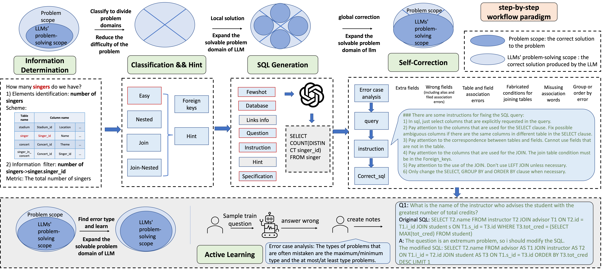

# Decomposition for Enhancing Attention: Improving LLM-based Text-to-SQL through Workflow Paradigm

Based on the idea that **D**ecomposition for **E**nhancing **A**ttention, we propose the workflow paradigm method named DEA-SQL with five major steps as shown in Figure. Check out our [paper](https://arxiv.org/abs/2402.10671) for more information.





## Requirements
```
nltk==3.8.1
sqlparse==0.4.2
openai==0.28.0
langchain==0.0.281
backoff==2.2.1
termcolor==2.3.0
pandas==2.0.3
scikit-learn==1.3.0
timeout_decorator==0.5.0
sql_metadata==2.9.0
transformers==4.32.0
torch==1.12.1
```
## Environment
1. pip install requirements
2. python nltk_downloader.py


## Data Preparation
Download the data set from the [spider official website](https://yale-lily.github.io/spider), unzip it and put it into the data folder. An example of the file directory is data/spider/database.

## Usage
Please modify the OpenAI configuration in common/static_config.py and configure the relevant environment variables for the Azure OpenAI API.

Several important parameters:
- **dataset**: The name of dataset.
- **few_shot_mode**: The method of retrieving fewshot can be selected from [random, ques_tim, masked_ques_sim].
- **few_shot_data**: The data of retrieving fewshot can be selected from [train_merge_v1, train_merge_v5]
- **insert_value**: The number of lines that are inserted in database prompt.
- **embedding_base_model**: The base embedding model in retrieving few-shot step.
- **sc_filter_nums**: The number of information filter layer.

## Quick Start

### prediction on the Spider Dev datasets
```
python main.py --save_file_name "dea-sql.txt" --dataset "spider" --mode "dev" --sample "False" --few_shot_mode "masked_ques_sim" --insert_value 3 --embedding_base_model "openai"  --sc_filter_nums 3 --few_shot_data "train_merge_v5"
```

### evaluation on the Spider Dev datasets
For the first evaluation, please perform: """python nltk_downloader.py"""

```
python evaluation/test-suite-sql-eval/evaluation.py --gold "evaluation/gold_files/spider_dev_gold.sql" --pred "outputs/spider/dea-sql.txt" --db ./data/spider/database --print_file_name "outputs/spider/spider-dea-sql.txt" --table './data/spider/tables.json' --etype exec
```

## Citing DEA-SQL

```
@article{xie2024decomposition,
      title={Decomposition for Enhancing Attention: Improving LLM-based Text-to-SQL through Workflow Paradigm}, 
      author={Yuanzhen Xie and Xinzhou Jin and Tao Xie and MingXiong Lin and Liang Chen and Chenyun Yu and Lei Cheng and ChengXiang Zhuo and Bo Hu and Zang Li},
      journal={arXiv preprint arXiv:2402.10671},
      year={2024}
}
```
