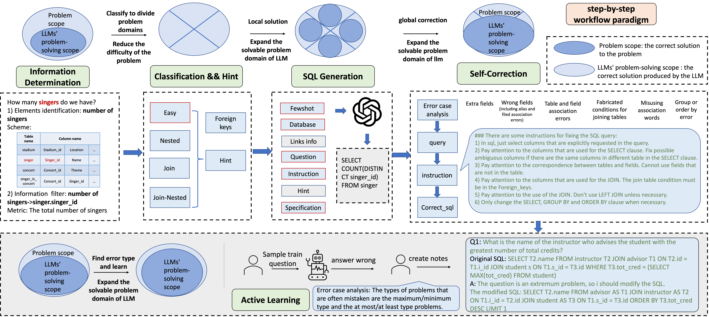

# Decomposition for Enhancing Attention: Improving LLM-based Text-to-SQL through Workflow Paradigm

### 🔥🔥 2024.05. DEA-SQL is accepted by Findings of ACL 2024!

Based on the idea that **D**ecomposition for **E**nhancing **A**ttention, we propose the workflow paradigm method named DEA-SQL with five major steps as shown in Figure. Check out our [paper](https://arxiv.org/abs/2402.10671) for more information.




## Set Up

### Environment

```bash
# 1. Clone the repo
git clone https://github.com/FlyingFeather/DEA-SQL.git
cd DEA-SQL && mkdir data

# 2. Make a conda environment
conda create -n deasql python=3.9
conda activate deasql

# 3. Install requirements
pip install -r requirements.txt
python nltk_downloader.py
```


### Dataset

Download the data set from the [spider official website](https://yale-lily.github.io/spider) under `DEA-SQL` , unzip it and put it into the `data` folder. 
We provide the data in [drive](https://drive.google.com/file/d/15tQXB7ilPXBxuJU7ynPeNk_nLqtg8XgK/view?usp=sharing) if it is unable to download dataset from spider official website.


```
mkdir data
unzip spider.zip -d data
```

The directory structure should be as follows:

```
.
├── argsparser.py
├── common
├── correct_sql.py
├── data
│   └── spider
│		├── ...
│		└── database
├── data_preprocess.py
├── docs
├── evaluation
├── fewshot
├── filter_characters.py
├── gen_sql.py
├── get_ner.py
├── hardness_eval.py
├── __init__.py
├── LICENSE
├── llm
├── logger.py
├── main.py
├── nltk_downloader.py
├── outputs
├── prompt
├── README.md
├── requirements.txt
└── single_eval.py
```


## Usage
Please modify the OpenAI configuration in `common/config/static_config.py` and configure the relevant environment variables for the Azure OpenAI API.

Several important parameters:
- **dataset**: The name of dataset.
- **few_shot_mode**: The method of retrieving fewshot can be selected from [random, ques_tim, masked_ques_sim].
- **few_shot_data**: The data of retrieving fewshot can be selected from [train_merge_v1, train_merge_v5]
- **insert_value**: The number of lines that are inserted in database prompt.
- **embedding_base_model**: The base embedding model in retrieving few-shot step.
- **sc_filter_nums**: The number of information filter layer.

## Quick Start

### prediction on the Spider Dev datasets
```
python main.py --save_file_name "dea-sql.txt" --dataset "spider" --mode "dev" --sample "False" --few_shot_mode "masked_ques_sim" --insert_value 3 --embedding_base_model "openai"  --sc_filter_nums 3 --few_shot_data "train_merge_v5"
```

### evaluation on the Spider Dev datasets
For the first evaluation, please perform: `python nltk_downloader.py`

```
python evaluation/test-suite-sql-eval/evaluation.py --gold "evaluation/gold_files/spider_dev_gold.sql" --pred "outputs/spider/dea-sql.txt" --db ./data/spider/database --print_file_name "outputs/spider/spider-dea-sql.txt" --table './data/spider/tables.json' --etype exec
```

## Citing DEA-SQL

```
@article{xie2024decomposition,
      title={Decomposition for Enhancing Attention: Improving LLM-based Text-to-SQL through Workflow Paradigm}, 
      author={Yuanzhen Xie and Xinzhou Jin and Tao Xie and MingXiong Lin and Liang Chen and Chenyun Yu and Lei Cheng and ChengXiang Zhuo and Bo Hu and Zang Li},
      journal={arXiv preprint arXiv:2402.10671},
      year={2024}
}
```
